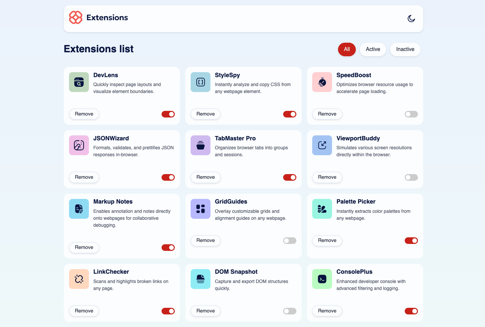
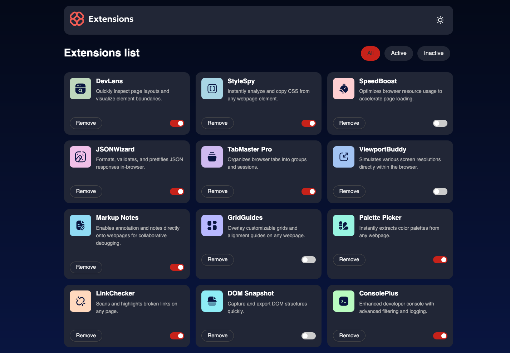

# Frontend Mentor - Browser extensions manager UI solution

This is a solution to the [Browser extensions manager UI challenge on Frontend Mentor](https://www.frontendmentor.io/challenges/browser-extension-manager-ui-yNZnOfsMAp).

## [Live Site URL](https://browser-extensions-mentor.netlify.app/)

## Table of contents

-   [Overview](#overview)
    -   [The challenge](#the-challenge)
    -   [Screenshot](#screenshot)
    -   [Links](#links)
-   [My process](#my-process)
    -   [Built with](#built-with)
    -   [What I learned](#what-i-learned)

## Overview

### The challenge

Users should be able to:

-   Toggle extensions between active and inactive states
-   Filter active and inactive extensions
-   Remove extensions from the list
-   Select their color theme
-   View the optimal layout for the interface depending on their device's screen size
-   See hover and focus states for all interactive elements on the page

### Screenshots

<div style="display: flex; gap: 1rem; justify-content: center; align-items: flex-start;">
  <figure>
    
  </figure>
  <figure>
    
  </figure>
</div>


## Built with

-   Semantic HTML5 markup
-   CSS custom properties
-   Flexbox
-   CSS Grid
-   JavaScript

## What I learned

Use something like this to create a responsive grid layout: Where `--grid-min` is the minimum size of the grid item and `--grid-max` is the maximum size of the grid item. And it's easily set with custom variables, so it's maintainable.

```css
.grid {
    display: grid;
    gap: 1rem;

    --grid-min: 20rem;
    --grid-max: 1fr;

    grid-template-columns: repeat(
        auto-fill,
        minmax(min(var(--grid-min), 100%), var(--grid-max))
    );
}
```
